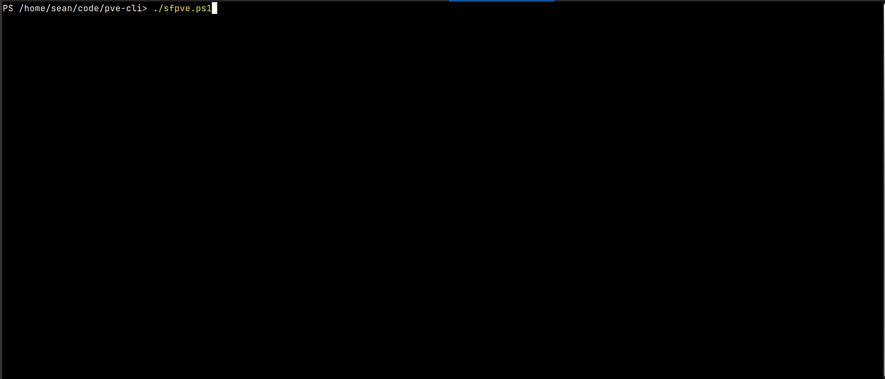
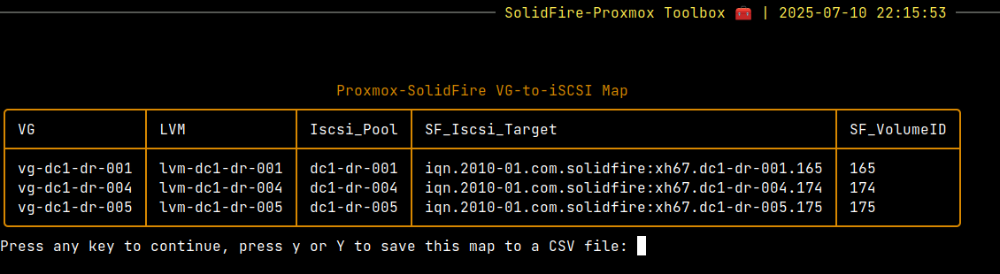

# Firemox - an opinionated Proxmox-SolidFire console in PowerShell

- [Firemox - an opinionated Proxmox-SolidFire console in PowerShell](#firemox---an-opinionated-proxmox-solidfire-console-in-powershell)
  - [About Firemox](#about-firemox)
    - [Traget audience](#traget-audience)
  - [Features](#features)
  - [How to use](#how-to-use)
    - [Configuration](#configuration)
    - [Storage on-boarding](#storage-on-boarding)
    - [Storage off-boarding](#storage-off-boarding)
  - [Firemox main menu](#firemox-main-menu)
    - [Firemox sub-menus](#firemox-sub-menus)
      - [Proxmox-SolidFire utilities](#proxmox-solidfire-utilities)
      - [SolidFire Volumes](#solidfire-volumes)
      - [SolidFire Volume Access Groups](#solidfire-volume-access-groups)
      - [First-time setup](#first-time-setup)
      - [SolidFire QoS](#solidfire-qos)
      - [Prepare SolidFire for first-time use](#prepare-solidfire-for-first-time-use)
  - [Limitations and workarounds](#limitations-and-workarounds)
    - [Non-primary PVE nodes may require a reboot to recognize new iSCSI pools](#non-primary-pve-nodes-may-require-a-reboot-to-recognize-new-iscsi-pools)
    - [Rare PVE API timeouts](#rare-pve-api-timeouts)
    - [Choice of PVE endpoint(s)](#choice-of-pve-endpoints)
    - [SolidFire snapshots](#solidfire-snapshots)
    - [iSCSI with different back-ends](#iscsi-with-different-back-ends)
  - [FAQs](#faqs)
    - [Resize (grow) PVE iSCSI pool size](#resize-grow-pve-iscsi-pool-size)
    - [Move VM from one VG (and iSCSI pool) to another](#move-vm-from-one-vg-and-iscsi-pool-to-another)
    - [Persistent device paths](#persistent-device-paths)
    - [Backup](#backup)
    - [Monitoring](#monitoring)
    - [Security](#security)
      - [SolidFire and PVE RBAC](#solidfire-and-pve-rbac)
      - [Data privacy and protection](#data-privacy-and-protection)
      - [Dependencies](#dependencies)
    - [Containerization](#containerization)


## About Firemox

Firemox is an opinionated console for storage-related management tasks related to Proxmox PVE with NetApp SolidFire (and NetApp HCI repurposed for PVE) written in PowerShell. 



**Note:** development system credentials may be seen in debug output. That was spotted before posting the animation. Don't bother reporting this or junk credentials from the sample configuration files as "vulnerabilities".

### Traget audience

Firemox isn't meant for outright production use: I haven't seen it delete random data, but anyone contemplating its use in production should first try it out in a test environment (which can use nested PVE and a dedicated storage tenant account) using workflows expected in production. 

Experienced SolidFire administrators with basic PowerShell skills (likely required to fix or improve the code) may find it to be a good starting point and make use of it in their VI environment.

## Features

- Prepare SolidFire and PVE (create storage account on SolidFire, configure iSCSI clients on PVE nodes)
- Create SolidFire volumes and QoS policies. Grow and retype existing volumes
- Register SolidFire volumes as PVE iSCSI storage pools and create VG/LVM on top of such iSCSI storage pools
- Remove empty VG/LVM/iSCSI storage from PVE (and optionally delete the SolidFire volume behind it)
- Small quality-of-life stuff like an end-to-end storage map, iSCSI network configuration view, account storage efficiency, etc.

## How to use

The main objective of Firemox is to offer consistency in the naming of SolidFire-related storage resources - that seemed the most annoying part of using PVE with SolidFire to me.

How that works:

- Start with a string named after PVE DC, such as `dc1` (this is set manually in Firemox (`sfVolumePrefix`, as some folks may want to use something else)
- Add SolidFire cluster name (lowercased), such as `dr` (this is automatic based on cluster name, so you'd have to change the script to use something else)
- Use three-digit numbers for volumes, such as `005`, so that the fifth volume created for this PVE becomes `dc1-dr-005`. These are auto-incremented.
- In PVE, register iSCSI pool using the same string as SolidFire volume (automatic)
- Then for LVM, prefix it with `lvm-`(automatic)
- And for VG, prefix the volume name with `vg-` (automatic).

That way we end up with a SolidFire volume and PVE iSCSI pool both named `dc1-dr-001`, and `vg-dc1-dr-005`, `lvm-dc1-dr-005` on top of it. 



When SolidFire volumes are created it is possible to override that initial PVE + SF pattern, but I haven't tested it much because I'm opinionated about this. If automation is successful, volume names shouldn't matter.

### Configuration

See the top of firemox.ps1:

- SolidFire API endpoint and credentials for a cluster admin with sufficient permissions to (at least) volumes
- PVE cluster admin with sufficient permissions for storage-related operations
- SolidFire Storage Tenant Account ID (you can create it beforehand in SolidFire UI and hard-code the ID (integer) in the script to avoid having to enter it every time)

It is possible to leave both SolidFire and PVE passwords empty and provide them at startup.

### Storage on-boarding

- SolidFire-side: create a SolidFire storage account and one or more iSCSI volume(s) for PVE
- PVE-side: register unused SolidFire volume as iSCSI pools (each iSCSI volume is a "pool")
- PVE-side: add VG/LVM on top of that that single-volume iSCSI pool
- PVE-side: use the VG for VMs and (LXC) CTs

### Storage off-boarding

It is like on-boarding but in reverse. 

Clean up VMs and CTs from a VG, remove the VG/LVM, and then un-register iSCSI pool underneath it. Note that unlike in on-boarding which can be done in bulk, off-boarding of PVE storage resources is limited to one storage object at a time (VG or storage pool).

Finally, delete (and purge if you want to release the space ASAP - it's also doable from Firefmox) the SolidFire LUN that iSCSI pool used.

## Firemox main menu

Menu items aren't ordered according to expected sequence of use, but according to expected frequency.

Lower-ranked items in the main menu are expected to be infrequently used. 

Daily use is probably limited to the top two items; PVE-related at the top and SolidFire volumes-related just below it.

The main thing to keep in mind is the on-boarding and off-boarding sequence above. The rest of items require common-sense SolidFire (or PowerShell) knowledge.

### Firemox sub-menus

#### Proxmox-SolidFire utilities

- View all PVE VG/LVM and iSCSI storage pool(s): view all known SolidFire iSCSI pools and LVM pools backed by SolidFire iSCSI pools. It is possible to have more iSCSI pools than configured LVM devices, which is why this view exists
- View end-to-end VG-to-IQN mapping: this shows PVE VG-to-SolidFire Volume mapping. Unlike the previous View, this one lets use see which VGs map to which SolidFire volumes. If a SolidFire volume from PVE iSCSI Pools doesn't have a VG, it won't be shown here
- Create VG/LVM: lets us create VG/LVM on an existing PVE iSCSI pool that's available. If you are using an iSCSI storage pool for direct access (most people won't, I think), you would want to avoid creating VG on such volumes even if they're "available"
- Create PVE iSCSI storage pool: if you created a SolidFire volume for PVE but haven't "registered" it in PVE, this is where registration or "import" is done before such volumes can be used for VG/LVM or direct access.
- Remove empty (void of VM/CT) PVE VG and LVM configuration: if you no longer need a VG or maybe want to remove an iSCSI pool, first remove VMs/CTs and then delete VG/LVM configuration here.
- Remove empty (void of VG/LVM configuration) PVE iSCSI pool: once VG/LVM configuration has been cleared, you can un-register (release back to SolidFire) iSCSI storage pools. After this step you may delete them on SolidFire (in SolidFire Volumes)
- View PVE and SolidFire storage network details: PVE hosts and SolidFire nodes with their iSCSI network IP addresses
- View SolidFire iSCSI targets exposed to PVE: the same thing you can see in table that lists SolidFire volumes in SolidFire Volumes menu. This is mostly useful if you've created a new SolidFire volume and want to see what's available to Proxmox before you create/register new iSCSI storage pool in "Create PVE iSCSI storage pool" above

**NOTE:** Firemox makes no checks for VMs or CTs when LVM/VG configuration and iSCSI pools are being removed. Migration/protection/deletion of VM/CT resources is the responsibility of the user. PVE may help you with some of these tasks and that's the main place where you should manage VMs and CTs.

#### SolidFire Volumes

Before we can register SolidFire iSCSI volumes as storage pools in PVE, they need to be created. 

This section lets you create, view (size, name, ID, QoS, creation time) and change them (expand in terms of size, and re-type in terms of QoS). Volume sizes are in GiB.

Regarding growing SolidFire volume size, VGs need to be enlarged after that (see further below). There's no way to shrink SolidFire volumes, and they're also thin-provisioned so it doesn't hurt to overprovision and spare yourself the trouble. But if you want a smaller volume, maybe create a new one and move VMs/CTs to it, then remove VG/LVM configuration and un-register the one you want to remove and delete in PVE, followed by deletion in SolidFire Volumes sub-menu.

It is also possible to add a volume (by volume ID) to a snapshot schedule and remove it from one. Snapshot schedules have many options and the last volume from a schedule cannot be removed without deleting the schedule, so snapshot schedule creation and deletion are not provided in Firemox. Restores are also not provided in Firemox because it's a sensitive operation that can cause loss of data (on volume which is being restored to its older point-in-time version). 

#### SolidFire Volume Access Groups

This is currently basic because it's optional. 

Firemox defaults to CHAP, so VAGs are an alternative way of limiting access to SolidFire targets that I don't think many users will use.

The utilities folder has scripts that can be used to bulk-add initiators to SolidFire and then to your PVE VAG, while volumes can be added in bulk from Firemox VAG sub-menu.

#### First-time setup

This does two things: gives you the opportunity to create a new SolidFire storage tenant account, and spits out a sample iSCSI client configuration for PVE nodes.

iSCSI example configuration offered by Firemox doesn't do anything special. You're free to modify the script or use own configuration as long as it's supported by PVE (Open iSCSI) and SolidFire.

As mentioned elsewhere, I don't recommend the use of Volume Access Groups but if you prefer that approach over CHAP, it's also easy. 

- IQNs: bulk-add them using the scripts in the utilities directory
- Volumes: bulk-add existing volumes to a VAG from Firemox SolidFire Volumes sub-menu
- Removal: when a SolidFire volume is purged, it's removed from its VAG(s), so that seems "automatic". Just remember to remove unnecessary IQNs by yourself because like volumes, IQNs remain on the cluster or VAG until deleted (which happens rarely, so I didn't add it to Firemox v1.0)

#### SolidFire QoS

There's nothing special here - list, create, edit and delete.

If you copy VMs and CTs between VGs (on different PVE iSCSI storage pools, obviously) you may want to set Burst IOPS to a higher value (50,000, for example) before copying and set it back after.

Remember that some VM/CT QoS settings may be available on the PVE side. Consider both sides when right-sizing your SolidFire QoS policies. As a rule of thumb, Min IOPS on a SolidFire volume should be equal to minimum commitments set on VMs/CTs on that volume.

#### Prepare SolidFire for first-time use

This has just two parts:

- Create a storage tenant in SolidFire
- Configure PVE hosts as iSCSI clients to SolidFire (you need a SolidFire volume to do that)

Firemox doesn't support multiple iSCSI back-ends to SolidFire, so iSCSI configuration changes PVE hosts to only connect to SolidFire iSCSI as the tenant account your PVE data-center uses.

## Limitations and workarounds

### Non-primary PVE nodes may require a reboot to recognize new iSCSI pools

This seems to be a PVE thing - the famous "gray question mark problem". I tried re-scanning SCSI devices, but that didn't help. It seems users of other shared storage come across this as well.

Until that works on PVE, it is suggested to create iSCSI/LVM on the host where you plan to use the new storage, and reboot other nodes (at least one, for HA) when convenient.

### Rare PVE API timeouts 

They sometimes happen, especially if some resource (RAM on the PVE API node too low, SolidFire Min/Max QoS extremely low, etc.) is insufficient. 

I noticed that VG/LVM creation takes longer if SolidFire QoS on the volume is extremely low, but that's easy to fix: simply refresh view of storage and if the operation has really failed, retry. In one case PVE API timed out (on VG creation), but the operation actually succeeded and I did not have to retry and, because Firemox is stateless, I was able to simply continue.

None of these are caused by SolidFire. If you see a timeout, check PVE to see if operation realy failed, and simply repeat it. This is one of the reasons PVE API operations are executed sequentially rather than in parallel (to minimize the load on PVE API endpoints).

### Choice of PVE endpoint(s)

Related to the limitation just above: in a clustered PVE environment, any node can be used as a PVE API endpoint. 

The node that's selected is usually the one where storage is first registered (you could use another, but with what purpose?) and because of that the VG ends up as active on that node. 

If you create a number of storage resources and don't want to have them all become active on a single node it may be desirable to switch to another API endpoint, but Firemox doesn't cater to that so you'd have to restart Firemox. I did consider the possibility of "spraying" requests around different PVE cluster members, but there's also the issue of "gray question mark" which means rolling reboots may be required in any case.

For now, if you create a lot of storage resources and want them to become "active" on different PVE nodes, restart Firemox with a different PVE API endpoint (create 2 pools here, restart with a different endpoint, 2 pools there, etc.). 

Firemox could provide this PVE endpoint switchover without needing a restart, but I don't expect many people will use Firemox in the first place (let alone create many storage resources).

### SolidFire snapshots

Firemox doesn't handle them, but you may add volumes to existing SolidFire snapshot schedules to have them protected in a cash-consistent way. You can of course also take snapshots from the SolidFire Web UI on your own.

I'm not sure they work as they do with other virtualization platforms, but I haven't looked into operational workflows. For example, if you take a snapshot of a volume with VM 100 and CT 101, move those to another place, and then restore that snapshot, there are probably different paths from there depending on whether you want to recover that VM and CT or not.

I tried a simple workflow (CT on VG/iSCSI Pool; take a snapshot, followed by a restore) and it worked. Some "freeze" scripts would probably be helpful, but with more than one VM/CT per VG this could get complicated as several (dozens?) would have to be successfully frozen before a storage snapshot of the VG beneath them could be taken. 

`LVM` (which Firemox uses on top of iSCSI pools) doesn't support snapshots (take a look at [this](https://pve.proxmox.com/pve-docs/chapter-pvesm.html#_storage_types) table with storage types and features). But []PVE version 9 has added that](https://forum.proxmox.com/threads/proxmox-ve-9-0-beta-released.168618/#post-784298) feature.

For KVM VMs, consider enabling Guest Agent for enhanced consistency with a combination of freeze scripts. See [here](https://pve.proxmox.com/wiki/Qemu-guest-agent) for related information. You could schedule VM freeze 10 seconds before SolidFire snapshots are scheduled to fire, and unfreeze right after SolidFire snapshots happen, or you could create a script that does this on demand. 

### iSCSI with different back-ends

Firemox uses `iSCSI/kernel` "driver" and assumes a single PVE storage back-end (NetApp SolidFire).

`iSCSI/libiscsi` (see the link with PVE storage types and features) may be a way to do connect to other back-ends, but I haven't looked at it. You could connect other back-ends and leave Firemox as-is.

## FAQs

Firemox doesn't try to do PVE's job, so for any problems or questions please check in the Proxmox community. 

Some strictly SolidFire-specific details are below and more may be added.

### Resize (grow) PVE iSCSI pool size

- Go to Firemox and in Solifire Volumes pick `Set SolidFire volume` to grow the SolidFire volume (up to 16 TiB). Optionally, retype it to a different QoS policy ID to lessen IOPS density loss due to volume growth
- On the PVE node that has active access to that LUN, run `pvresize` on the enlarged volume

Example: `dc1-dr-001` was enlarged on SolidFire from 5 to 30 GiB. `vg-dc1-dr-001` needs to be made aware of that.

```sh
root@s194:~# vgdisplay
  --- Volume group ---
  VG Name               vg-dc1-dr-001
  System ID             
  Format                lvm2
  Metadata Areas        1
  Metadata Sequence No  1
  VG Access             read/write
  VG Status             resizable
  MAX LV                0
  Cur LV                0
  Open LV               0
  Max PV                0
  Cur PV                1
  Act PV                1
  VG Size               <5.00 GiB
  PE Size               4.00 MiB
  Total PE              1279
  Alloc PE / Size       0 / 0   
  Free  PE / Size       1279 / <5.00 GiB
  VG UUID               f8bAMz-rxrL-2NZM-3cl4-b4Vz-g58s-QqrJq7


root@s194:~# pvs
  PV         VG            Fmt  Attr PSize   PFree 
  /dev/sda3  pve           lvm2 a--  <15.50g  8.00m
  /dev/sdk   vg-dc1-dr-001 lvm2 a--   <5.00g <5.00g

root@s194:~# pvresize /dev/sdk
  Physical volume "/dev/sdk" changed
  1 physical volume(s) resized or updated / 0 physical volume(s) not resized

root@s194:~# pvs
  PV         VG            Fmt  Attr PSize   PFree  
  /dev/sda3  pve           lvm2 a--  <15.50g   8.00m
  /dev/sdk   vg-dc1-dr-001 lvm2 a--  <30.00g <30.00g

root@s194:~# vgs
  VG            #PV #LV #SN Attr   VSize   VFree  
  pve             1   9   0 wz--n- <15.50g   8.00m
  vg-dc1-dr-001   1   0   0 wz--n- <30.00g <30.00g

root@s194:~# vgdisplay
  --- Volume group ---
  VG Name               vg-dc1-dr-001
  System ID             
  Format                lvm2
  Metadata Areas        1
  Metadata Sequence No  3
  VG Access             read/write
  VG Status             resizable
  MAX LV                0
  Cur LV                1
  Open LV               0
  Max PV                0
  Cur PV                1
  Act PV                1
  VG Size               <30.00 GiB
  PE Size               4.00 MiB
  Total PE              7679
  Alloc PE / Size       2048 / 8.00 GiB
  Free  PE / Size       5631 / <22.00 GiB
  VG UUID               f8bAMz-rxrL-2NZM-3cl4-b4Vz-g58s-QqrJq7

```

### Move VM from one VG (and iSCSI pool) to another 

See [this](https://forum.proxmox.com/threads/how-to-move-vm-to-another-storage.145995/post-658409) and other comments in this thread.

You can temporary increase SolidFire QoS Max and Burst IOPS (see [this](https://scaleoutsean.github.io/2020/11/28/powershell-set-sfqosexception.html)) on both source and destination iSCSI volume prior to migration/copying and reset it after that. That's one of the reasons Firemox strongly recommends using QoS policies rather than custom settings - it makes storage QoS management easier.

### Persistent device paths

As you can see in Firemox (`Utilities` > `Get SolidFire cluster's iSCSI targets exposed to Proxmox VE`), you can access devices at this path:

`/dev/disk/by-id/wwn-0x6f47acc100000000<hex-clusterId><hex-vol-id-left-padded-to-8bytes>`

Multi-pathing is not recommended (or "supproted") by Firemox. LACP-only redundancy is assumed, and recommended.

### Backup

Firemox has no integration with Proxmox Backup. 

[Pre- and post-backup jobs could make QoS adjustments](https://scaleoutsean.github.io/2020/11/28/powershell-set-sfqosexception.html) to make backups (and restores) faster.

SolidFire volumes used by PVE can be backed up to S3 on their own (very basic backup without catalog - I've blogged about it extensively), which is a separate topic. See my Awesome SolidFire repository for some additional pointers and scripts.

### Monitoring

It can be done, but why? About the only "monitoring-related" thing I could think of is PVE tenant's storage efficiency on SolidFire and and I've added that as I was writing this and concluded it makes sense. (By the way, SolidFire efficiency is global so there's no need to "group" similar VMs or CTs to "improve" deduplication.)

But Firemox isn't the right place for performance monitoring. There are many better ways to monitor PVE and SolidFire. 

For SolidFire you have [SolidFire Exporter](https://github.com/mjavier2k/solidfire-exporter) (a Prometheus exporter for SolidFire) and [SFC](https://github.com/scaleoutsean/sfc/) (my collector for SolidFire which stores data in InfluxDB 3), both of which gather data that can be visualized in Grafana.

### Security

#### SolidFire and PVE RBAC

- SolidFire has limited ABAC/RBAC features, but it is possible to create a cluster admin account that is allowed access only to volumes, which is probably the most conservative setting possible (and may not be able to create VAGs or QoS, but you could use a full-featured cluster account to do that once)
- PVE has richer, but also complicated, roles and it is possible to create an API user with the exact access you need

#### Data privacy and protection

Firemox does not collect or send any data whatsoever. 

If you want, you can add only allowed routes on the VM where you use it (one to SolidFire MVIP, several to PVE node(s)).

#### Dependencies

The only module required is the open source PwshSpectreConsole written by a reputable PowerShell developer and community member.

### Containerization

As mentioned in Security, isolated Firemox could be desirable for some users, so there's a Dockerfile and two other files related to it to help you get started. 

I don't know anyone would need that in a test or lab environment, so for now I'll just post these files as they are and if people use them I'll make sure they can work. Please do not assume they'll work without bug fixes - they haven't been tested.


